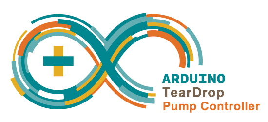
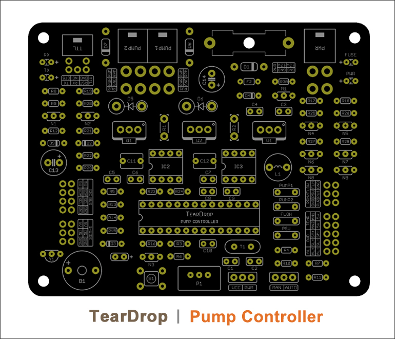
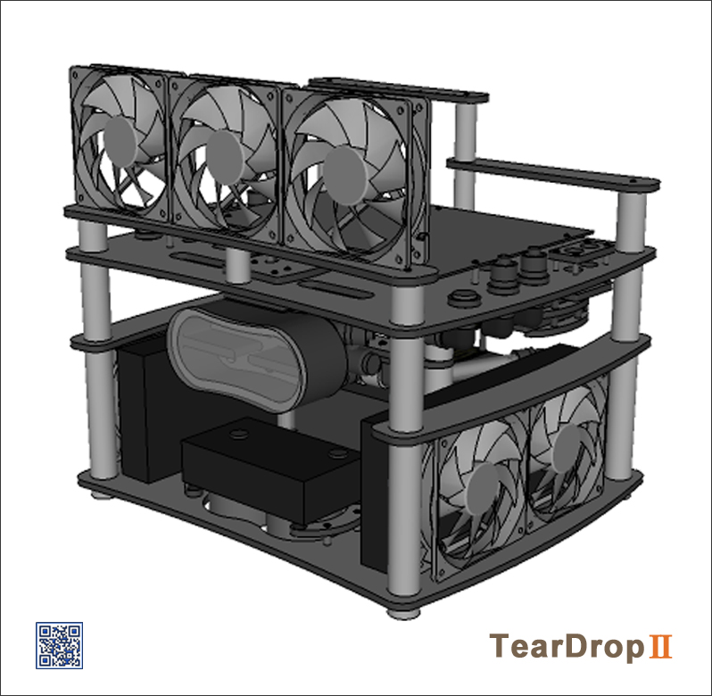
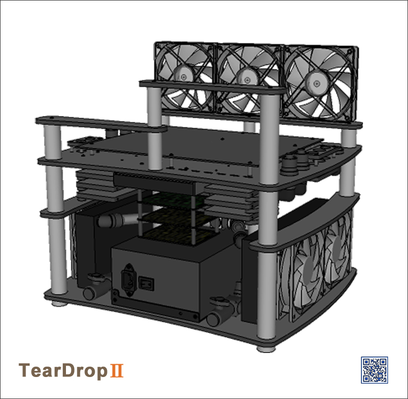

#TearDrop | Pump Controller

##Table of Contents

* [Screenshots](#screenshots)
* [General Description](#general-description)
* [License](#license)

##Screenshots

<table>
	<tr>
		<td align="center" width=25% >
			
		</td>
		<td align="center" width=25% >
			
		</td>
		<td align="center" width=25% >
			
		</td>
		<td align="center" width=25% >
			
		</td>
	</tr>
</table>

##General Description
 
<strong>TearDrop</strong>

##  License

Released under the <a href="http://www.opensource.org/licenses/MIT">MIT license</a>.

